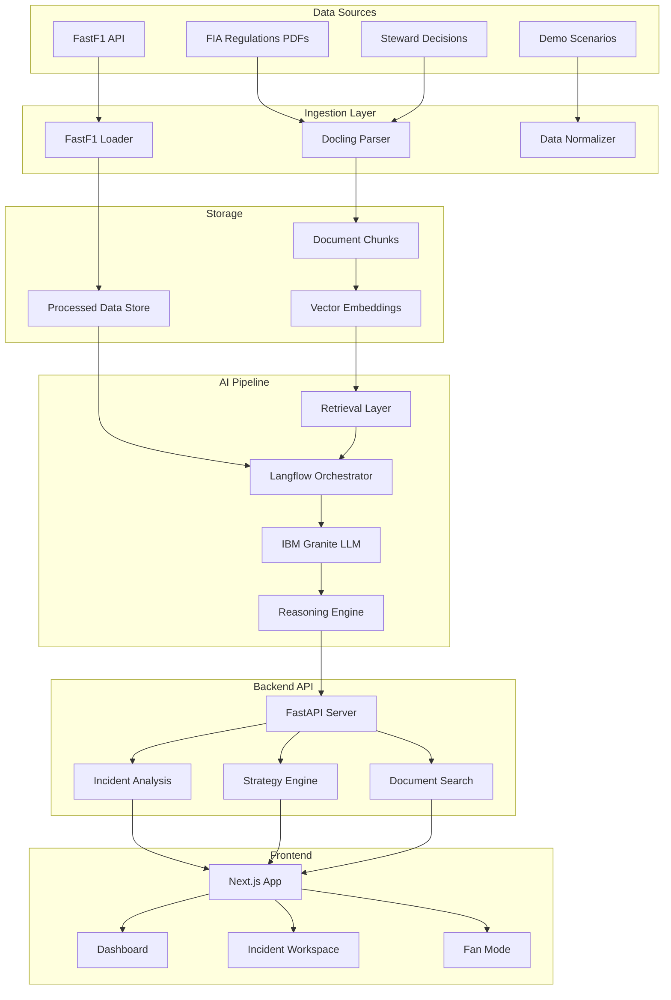

# RaceLens XAI

**Explainable motorsport intelligence for race control, engineers, analysts, and fans.**


## 🏁 Problem Statement

In modern motorsport, split-second decisions can determine race outcomes. Race engineers, stewards, and strategists need to make critical calls under pressure:
- Should we pit now or extend the stint?
- Was that incident worthy of a penalty?
- Which regulation clause applies to this situation?
- How do we explain complex decisions to fans and media?

Current tools provide data but lack **transparent reasoning**. Teams and officials need AI that doesn't just recommend—it **explains why**.

## 🎯 Why This Matters

**For Race Engineers**: Make confident strategy calls backed by explainable AI reasoning, not black-box predictions.

**For Stewards**: Ground incident decisions in regulations with precedent-based explanations and confidence scores.

**For Broadcasters**: Translate complex technical decisions into fan-friendly commentary instantly.

**For Fans**: Understand the "why" behind race control decisions, strategy calls, and technical rulings.

## 🚀 The RaceLens XAI Difference

This is **not another telemetry dashboard**. RaceLens XAI is an **explainability-first race intelligence system** that:

1. **Connects** telemetry, documents, and incidents
2. **Reasons** using regulation-grounded AI
3. **Explains** with confidence scores, evidence traces, and "why not" alternatives
4. **Translates** technical decisions into fan-friendly language

## 🏗️ Architecture



## 🔧 IBM Stack Integration

### IBM Granite
- **Role**: Core reasoning and explanation LLM
- **Usage**: 
  - Incident classification with confidence scores
  - Strategy recommendation generation
  - Rule-grounded decision explanations
  - Fan-mode translation
  - "Why not" alternative analysis

### Docling
- **Role**: Document parsing and chunk extraction
- **Usage**:
  - Parse FIA regulation PDFs into structured chunks
  - Extract steward decision metadata (fact, offence, decision, reason)
  - Create searchable document corpus for RAG

### Langflow
- **Role**: AI workflow orchestration
- **Usage**:
  - End-to-end retrieval + reasoning pipeline
  - Multi-step incident analysis flow
  - Strategy decision workflow
  - Document search and evidence retrieval

## 📁 Project Structure

```
racelens-xai/
├── frontend/                 # Next.js application
│   ├── src/
│   │   ├── app/             # App router pages
│   │   ├── components/      # React components
│   │   ├── lib/             # Utilities and API clients
│   │   └── styles/          # Global styles
│   ├── public/              # Static assets
│   └── package.json
├── backend/                 # FastAPI server
│   ├── app/
│   │   ├── api/            # API routes
│   │   ├── services/       # Business logic
│   │   ├── models/         # Data models
│   │   └── main.py         # App entry point
│   ├── requirements.txt
│   └── Dockerfile
├── data/                    # Data storage
│   ├── raw/                # Raw data files
│   ├── processed/          # Processed data
│   └── demo/               # Demo scenarios
├── scripts/                 # Data ingestion scripts
│   ├── fetch_fastf1_data.py
│   ├── download_fia_docs.py
│   ├── parse_docs_with_docling.py
│   └── seed_demo_scenarios.py
├── flows/                   # Langflow configurations
│   ├── incident_analysis.json
│   ├── strategy_reasoning.json
│   └── fan_translation.json
├── docs/                    # Documentation
│   ├── ARCHITECTURE.md
│   ├── DEPLOYMENT.md
│   └── API.md
├── .env.example
└── README.md
```

## 🚀 Quick Start

### Prerequisites

- Node.js 18+ and npm/yarn
- Python 3.10+
- Git

### 1. Clone Repository

```bash
git clone https://github.com/yourusername/racelens-xai.git
cd racelens-xai
```

### 2. Environment Setup

```bash
cp .env.example .env
# Edit .env with your API keys
```

### 3. Install Dependencies

**Frontend:**
```bash
cd frontend
npm install
```

**Backend:**
```bash
cd backend
pip install -r requirements.txt
```

### 4. Fetch Demo Data

```bash
cd scripts
python fetch_fastf1_data.py
python download_fia_docs.py
python parse_docs_with_docling.py
python seed_demo_scenarios.py
```

### 5. Run Development Servers

**Backend:**
```bash
cd backend
uvicorn app.main:app --reload --port 8000
```

**Frontend:**
```bash
cd frontend
npm run dev
```

Visit `http://localhost:3000` to see the application.

## 🎬 Demo Scenarios

RaceLens XAI includes 5 pre-configured demo scenarios:

### 1. Qualifying Impeding
- **Context**: Driver A on fast lap blocked by Driver B on slow lap
- **Sector**: Turn 7-8 complex
- **Speed Delta**: 45 km/h
- **Regulation**: Article 37.5 - Impeding
- **Expected Outcome**: Grid penalty + fine

### 2. Pit Lane Unsafe Release
- **Context**: Car released into path of approaching car
- **Gap**: 0.8 seconds
- **Regulation**: Article 34.14 - Unsafe Release
- **Expected Outcome**: Time penalty + reprimand

### 3. Lap 1 Avoidable Collision
- **Context**: Contact at Turn 1 causing retirement
- **Fault Assessment**: 70% Driver A, 30% racing incident
- **Regulation**: Article 38.1 - Causing Collision
- **Expected Outcome**: 5-second penalty

### 4. Track Limits & Gained Advantage
- **Context**: Multiple track limit violations, position gained
- **Violations**: 4 corners, 0.3s advantage
- **Regulation**: Article 33.3 - Track Limits
- **Expected Outcome**: Position swap + warning

### 5. Rain Strategy Dilemma
- **Context**: Rain approaching, tire degradation high
- **Options**: Pit now vs. extend 3 laps
- **Factors**: Weather radar, tire life, traffic
- **Recommendation**: Pit within 2 laps with 78% confidence

## 🎨 Design System

### Color Palette
- **Background**: `#0A0E14` (Deep Anthracite)
- **Surface**: `#1A1F2E` (Gunmetal)
- **Accent Red**: `#E63946` (Racing Red)
- **Accent Cyan**: `#00D9FF` (Telemetry Blue)
- **Accent Amber**: `#FFB703` (Warning)
- **Accent Green**: `#06FFA5` (Safe/Legal)

### Typography
- **Headings**: Orbitron (Technical Display)
- **Body**: Inter (Clean Readability)
- **Numeric**: Tabular Numerals (Timing Data)

### Motion
- Smooth 60fps animations
- Scroll-based reveals
- Chart drawing animations
- Respects `prefers-reduced-motion`

## 📊 Features

### 1. Live Incident Risk Detection
- Real-time monitoring of race events
- Risk scoring based on telemetry patterns
- Proactive alerts for potential incidents

### 2. Explainable Strategy Suggestions
- Context-aware pit stop recommendations
- Tire management guidance
- Weather-based strategy pivots
- Confidence scores with reasoning

### 3. Rule-Grounded Steward Reasoning
- Regulation clause matching
- Precedent case retrieval
- Structured decision explanations
- Alternative interpretation analysis

### 4. Fan-Friendly Commentary Mode
- Technical-to-simple translation
- Visual incident breakdowns
- "What this means" summaries
- Share-ready explanation cards

### 5. Trust Layer
- Evidence traces
- Confidence metrics
- "Why this / Why not" explanations
- Source attribution

## 🔌 API Endpoints

### Incidents
- `POST /api/incidents/analyze` - Analyze incident
- `GET /api/incidents/{id}` - Get incident details
- `GET /api/incidents/feed` - Live incident feed

### Strategy
- `POST /api/strategy/recommend` - Get strategy recommendation
- `POST /api/strategy/explain` - Explain strategy decision
- `GET /api/strategy/scenarios` - List strategy scenarios

### Documents
- `GET /api/documents/search` - Search regulations
- `GET /api/documents/{id}` - Get document details
- `GET /api/documents/chunks` - Get parsed chunks

### Telemetry
- `GET /api/telemetry/session/{id}` - Get session data
- `GET /api/telemetry/driver/{id}` - Get driver telemetry
- `GET /api/telemetry/compare` - Compare drivers

## 🚢 Deployment

### Frontend (Vercel)

```bash
cd frontend
vercel --prod
```

### Backend (Render/Railway)

**Render:**
```bash
# Connect GitHub repo to Render
# Set environment variables
# Deploy automatically on push
```

**Railway:**
```bash
railway login
railway init
railway up
```

### Environment Variables

See `.env.example` for required variables:
- `IBM_GRANITE_API_KEY`
- `IBM_GRANITE_API_URL`
- `LANGFLOW_API_KEY`
- `NEXT_PUBLIC_API_URL`

## 🧪 Testing

```bash
# Frontend tests
cd frontend
npm test

# Backend tests
cd backend
pytest
```

## 📈 Future Roadmap

- [ ] Real-time race integration
- [ ] Multi-series support (Formula E, IndyCar, WEC)
- [ ] Mobile app
- [ ] Team collaboration features
- [ ] Historical race analysis
- [ ] Predictive incident modeling
- [ ] Voice-activated queries
- [ ] AR/VR visualization

## 🤝 Contributing

Contributions welcome! Please read our contributing guidelines.

## 📄 License

MIT License - see LICENSE file for details.

## ⚠️ Disclaimer

This website is unofficial and is not associated in any way with the Formula 1 companies. F1, FORMULA ONE, FORMULA 1, FIA FORMULA ONE WORLD CHAMPIONSHIP, GRAND PRIX and related marks are trade marks of Formula One Licensing B.V.

This platform is built for educational and demonstration purposes, showcasing explainable AI capabilities in motorsport contexts. All data used is from publicly available sources or generated for demonstration purposes.

## 🏆 Built With

- **Frontend**: Next.js 14, React, Tailwind CSS, Framer Motion
- **Backend**: FastAPI, Python
- **AI**: IBM Granite, Langflow, Docling
- **Data**: FastF1, FIA Public Documents
- **Deployment**: Vercel, Render

## 📞 Contact

For questions or feedback, please open an issue or contact the maintainers.

---

**When every millisecond matters, trust the reason behind the decision.**