# RaceLens XAI Architecture

## System Overview

RaceLens XAI is an explainable AI platform for motorsport incident analysis and race strategy recommendations. The system combines real telemetry data, regulatory documents, and IBM's enterprise AI stack to deliver transparent, regulation-grounded decisions.

## Architecture Diagram

```mermaid
graph TB
    subgraph "Frontend Layer"
        UI[Next.js 14 UI]
        Landing[Landing Page]
        Dashboard[Dashboard]
        Incidents[Incident Analysis]
        Strategy[Strategy Workspace]
        Documents[Document Explorer]
        FanMode[Fan Mode]
        About[About Page]
    end

    subgraph "API Gateway"
        FastAPI[FastAPI Backend]
        Health[Health Check]
        IncidentAPI[Incident API]
        StrategyAPI[Strategy API]
        DocAPI[Document API]
        TelemetryAPI[Telemetry API]
    end

    subgraph "Data Ingestion Layer"
        FastF1[FastF1 Loader]
        DocParser[Docling Parser]
        DataNorm[Data Normalizer]
    end

    subgraph "Data Sources"
        F1Data[(FastF1 Sessions)]
        FIADocs[(FIA Regulations)]
        StewardDocs[(Steward Decisions)]
        DemoData[(Demo Scenarios)]
    end

    subgraph "AI Pipeline"
        Langflow[Langflow Orchestrator]
        Retrieval[Retrieval Layer]
        VectorDB[(Vector Store)]
        Granite[IBM Granite LLM]
        PromptTemplates[Prompt Templates]
    end

    subgraph "Processing Layer"
        IncidentAnalysis[Incident Classifier]
        StrategyEngine[Strategy Recommender]
        FanTranslator[Fan Mode Translator]
        ConfidenceScorer[Confidence Scorer]
        EvidenceTracer[Evidence Tracer]
    end

    subgraph "Storage Layer"
        ProcessedData[(Processed Data)]
        ChunkStore[(Document Chunks)]
        SessionCache[(Session Cache)]
    end

    %% Frontend to API
    UI --> FastAPI
    Landing --> FastAPI
    Dashboard --> FastAPI
    Incidents --> IncidentAPI
    Strategy --> StrategyAPI
    Documents --> DocAPI
    FanMode --> IncidentAPI

    %% API to Processing
    FastAPI --> Health
    FastAPI --> IncidentAPI
    FastAPI --> StrategyAPI
    FastAPI --> DocAPI
    FastAPI --> TelemetryAPI

    %% Data Ingestion Flow
    F1Data --> FastF1
    FIADocs --> DocParser
    StewardDocs --> DocParser
    DemoData --> DataNorm
    
    FastF1 --> DataNorm
    DocParser --> DataNorm
    DataNorm --> ProcessedData
    DataNorm --> ChunkStore

    %% AI Pipeline Flow
    IncidentAPI --> Langflow
    StrategyAPI --> Langflow
    DocAPI --> Retrieval
    
    Langflow --> Retrieval
    Retrieval --> VectorDB
    VectorDB --> ChunkStore
    
    Langflow --> Granite
    Granite --> PromptTemplates
    
    Langflow --> IncidentAnalysis
    Langflow --> StrategyEngine
    Langflow --> FanTranslator
    
    IncidentAnalysis --> ConfidenceScorer
    StrategyEngine --> ConfidenceScorer
    IncidentAnalysis --> EvidenceTracer
    StrategyEngine --> EvidenceTracer

    %% Data Access
    TelemetryAPI --> ProcessedData
    TelemetryAPI --> SessionCache
    IncidentAnalysis --> ProcessedData
    StrategyEngine --> ProcessedData

    %% Styling
    classDef frontend fill:#00d4ff,stroke:#00a8cc,stroke-width:2px,color:#000
    classDef api fill:#ff4444,stroke:#cc0000,stroke-width:2px,color:#fff
    classDef ai fill:#44ff44,stroke:#00cc00,stroke-width:2px,color:#000
    classDef data fill:#ffaa00,stroke:#cc8800,stroke-width:2px,color:#000
    classDef storage fill:#aa44ff,stroke:#8800cc,stroke-width:2px,color:#fff

    class UI,Landing,Dashboard,Incidents,Strategy,Documents,FanMode,About frontend
    class FastAPI,Health,IncidentAPI,StrategyAPI,DocAPI,TelemetryAPI api
    class Langflow,Retrieval,Granite,PromptTemplates,IncidentAnalysis,StrategyEngine,FanTranslator,ConfidenceScorer,EvidenceTracer ai
    class FastF1,DocParser,DataNorm,F1Data,FIADocs,StewardDocs,DemoData data
    class ProcessedData,ChunkStore,SessionCache,VectorDB storage
```



## Component Details

### Frontend Layer (Next.js 14)

**Technology Stack:**
- Framework: Next.js 14 with App Router
- Styling: Tailwind CSS with custom motorsport design system
- Animations: Framer Motion
- Charts: Recharts
- State Management: React hooks

**Pages:**
1. **Landing Page** - Hero section, features, IBM stack showcase, demo scenarios
2. **Dashboard** - Live incident feed, strategy recommendations, KPI cards, telemetry charts
3. **Incident Analysis** - Detailed incident workspace with evidence, precedents, fan summaries
4. **Strategy Workspace** - Strategy recommendations with alternatives and "why this/why not" analysis
5. **Document Explorer** - Searchable regulation and steward decision viewer
6. **Fan Mode** - Simplified explanations for casual users
7. **About Page** - Architecture, use cases, core principles

### API Gateway (FastAPI)

**Endpoints:**
- `GET /health` - Health check
- `GET /api/incidents` - List incidents
- `GET /api/incidents/{id}` - Get incident details
- `POST /api/incidents/analyze` - Analyze new incident
- `GET /api/strategy/recommendations` - Get strategy recommendations
- `POST /api/strategy/analyze` - Analyze strategy scenario
- `GET /api/documents` - Search documents
- `GET /api/documents/{id}` - Get document details
- `GET /api/telemetry/session/{session_id}` - Get session telemetry
- `GET /api/telemetry/lap/{lap_id}` - Get lap telemetry

**Features:**
- CORS middleware for frontend integration
- Request validation with Pydantic
- Error handling and logging
- Environment-based configuration
- Health monitoring

### Data Ingestion Layer

**FastF1 Loader:**
- Fetches session data (laps, telemetry, weather, tyres, positions)
- Caches data locally for performance
- Normalizes data format for AI pipeline
- Supports multiple seasons and events

**Docling Parser:**
- Parses FIA regulation PDFs
- Extracts steward decision documents
- Chunks documents for retrieval
- Preserves document structure and metadata
- Generates embeddings for semantic search

**Data Normalizer:**
- Converts raw data to standardized format
- Validates data integrity
- Enriches with metadata
- Stores in processed data layer

### AI Pipeline

**Langflow Orchestrator:**
- Visual workflow builder for AI chains
- Connects retrieval → reasoning → explanation
- Manages prompt templates
- Handles error recovery
- Logs execution traces

**Retrieval Layer:**
- Semantic search over document chunks
- Finds relevant regulations and precedents
- Ranks results by relevance
- Provides context for reasoning

**IBM Granite LLM:**
- Enterprise-grade reasoning engine
- Generates explainable decisions
- Produces confidence scores
- Creates multi-level explanations (technical + fan mode)
- Grounds outputs in retrieved evidence

**Prompt Templates:**
1. Incident Analysis - Classifies incidents with regulation grounding
2. Strategy Decision - Recommends strategies with alternatives
3. Fan Translation - Converts technical to simple language
4. Rule Grounding - Cites specific regulations
5. Why Not Alternative - Explains rejected options
6. Confidence Scoring - Assesses decision certainty
7. Evidence Extraction - Identifies supporting facts

### Processing Layer

**Incident Classifier:**
- Analyzes incident context (speed, position, flags, sector)
- Retrieves similar precedents
- Applies regulation rules
- Generates classification with confidence
- Produces evidence trace

**Strategy Recommender:**
- Evaluates session context (weather, tyres, traffic, pace)
- Considers multiple strategy options
- Explains reasoning for each option
- Recommends optimal strategy
- Provides "why not" for alternatives

**Fan Mode Translator:**
- Simplifies technical explanations
- Uses relatable analogies
- Maintains accuracy while improving accessibility
- Generates shareable summaries

**Confidence Scorer:**
- Evaluates decision certainty
- Considers evidence quality
- Accounts for precedent similarity
- Flags uncertain decisions

**Evidence Tracer:**
- Links decisions to source data
- Cites specific regulations
- References precedent cases
- Provides audit trail

### Storage Layer

**Processed Data:**
- Normalized telemetry and session data
- Incident scenarios
- Strategy contexts
- JSON format for fast access

**Document Chunks:**
- Parsed regulation sections
- Steward decision excerpts
- Embeddings for semantic search
- Metadata for filtering

**Session Cache:**
- Frequently accessed telemetry
- Recent analysis results
- User session data
- Performance optimization

## Data Flow

### Incident Analysis Flow

```
User Input (Incident Details)
    ↓
Frontend (Incident Analysis Page)
    ↓
API Gateway (POST /api/incidents/analyze)
    ↓
Langflow Orchestrator
    ↓
Retrieval Layer (Find similar incidents + regulations)
    ↓
IBM Granite (Analyze with context)
    ↓
Incident Classifier (Generate classification)
    ↓
Confidence Scorer (Assess certainty)
    ↓
Evidence Tracer (Link to sources)
    ↓
Fan Translator (Create simple summary)
    ↓
API Response (Multi-level explanation)
    ↓
Frontend (Display results with evidence)
```

### Strategy Recommendation Flow

```
Session Context (Weather, Tyres, Traffic, Pace)
    ↓
Frontend (Strategy Workspace)
    ↓
API Gateway (POST /api/strategy/analyze)
    ↓
Langflow Orchestrator
    ↓
Retrieval Layer (Find similar scenarios)
    ↓
IBM Granite (Evaluate options)
    ↓
Strategy Engine (Generate recommendations)
    ↓
Confidence Scorer (Assess each option)
    ↓
Evidence Tracer (Link to data)
    ↓
API Response (Recommendations + alternatives)
    ↓
Frontend (Display with "why this/why not")
```

### Document Search Flow

```
User Query (Search term)
    ↓
Frontend (Document Explorer)
    ↓
API Gateway (GET /api/documents?q=...)
    ↓
Retrieval Layer (Semantic search)
    ↓
Vector DB (Find matching chunks)
    ↓
Document Store (Retrieve full context)
    ↓
API Response (Ranked results)
    ↓
Frontend (Display with highlights)
```

## Technology Choices

### Why Next.js 14?
- Server components for performance
- App Router for modern routing
- Built-in optimization (images, fonts, code splitting)
- Easy Vercel deployment
- Excellent developer experience

### Why FastAPI?
- High performance (async/await)
- Automatic API documentation
- Type safety with Pydantic
- Easy integration with Python AI libraries
- Production-ready

### Why IBM Granite?
- Enterprise-grade LLM
- Optimized for reasoning tasks
- Transparent and explainable
- Regulation-compliant
- IBM support and reliability

### Why Docling?
- Purpose-built for document parsing
- Preserves structure and metadata
- Handles complex PDFs
- Generates quality chunks for RAG
- IBM-supported

### Why Langflow?
- Visual workflow builder
- Easy to modify and debug
- Supports complex AI chains
- Integrates with multiple LLMs
- Open source with enterprise support

### Why FastF1?
- Official-quality telemetry data
- Well-documented API
- Active community
- Caching for performance
- Free and open source

## Deployment Architecture

### Frontend (Vercel)
```
GitHub Repository
    ↓
Vercel Build
    ↓
Edge Network (CDN)
    ↓
Users (Global)
```

### Backend (Render/Railway)
```
GitHub Repository
    ↓
Container Build
    ↓
Cloud Instance
    ↓
API Endpoints
```

### Environment Variables
```
# Frontend
NEXT_PUBLIC_API_URL=http://localhost:8000

# Backend
IBM_GRANITE_API_KEY=your_key_here
IBM_GRANITE_API_URL=https://api.ibm.com/granite
DOCLING_API_KEY=your_key_here
LANGFLOW_API_KEY=your_key_here
DATABASE_URL=sqlite:///./racelens.db
CORS_ORIGINS=http://localhost:3000,https://racelens.vercel.app
```

## Security Considerations

1. **API Keys** - Stored in environment variables, never committed
2. **CORS** - Restricted to known frontend origins
3. **Rate Limiting** - Prevents abuse of AI endpoints
4. **Input Validation** - All inputs validated with Pydantic
5. **Error Handling** - No sensitive data in error messages
6. **Logging** - Audit trail for all AI decisions

## Performance Optimizations

1. **Caching** - FastF1 data cached locally, API responses cached
2. **Lazy Loading** - Images and components loaded on demand
3. **Code Splitting** - Next.js automatic code splitting
4. **CDN** - Static assets served from edge network
5. **Database Indexing** - Fast queries on processed data
6. **Batch Processing** - Multiple incidents analyzed together

## Scalability

1. **Horizontal Scaling** - Backend can run multiple instances
2. **Stateless API** - No session state in backend
3. **Database** - Can migrate from SQLite to PostgreSQL
4. **Caching Layer** - Redis for distributed caching
5. **Load Balancing** - Multiple backend instances behind load balancer

## Monitoring and Observability

1. **Health Checks** - `/health` endpoint for uptime monitoring
2. **Logging** - Structured logs for debugging
3. **Metrics** - API response times, error rates
4. **Tracing** - Request flow through system
5. **Alerts** - Notifications for failures

## Future Enhancements

1. **Real-Time Updates** - WebSocket for live race data
2. **User Accounts** - Save preferences and history
3. **Custom Workflows** - User-defined Langflow chains
4. **Mobile App** - Native iOS/Android apps
5. **Multi-Language** - Support for multiple languages
6. **Advanced Analytics** - Trend analysis and predictions
7. **Integration APIs** - Third-party integrations
8. **Machine Learning** - Custom models for specific tasks

## License and Compliance

- **Code**: MIT License
- **Data**: FastF1 (MIT), FIA documents (editorial use)
- **Disclaimer**: Unofficial, not associated with Formula 1
- **Trademarks**: F1, FORMULA ONE, etc. are trademarks of Formula One Licensing B.V.